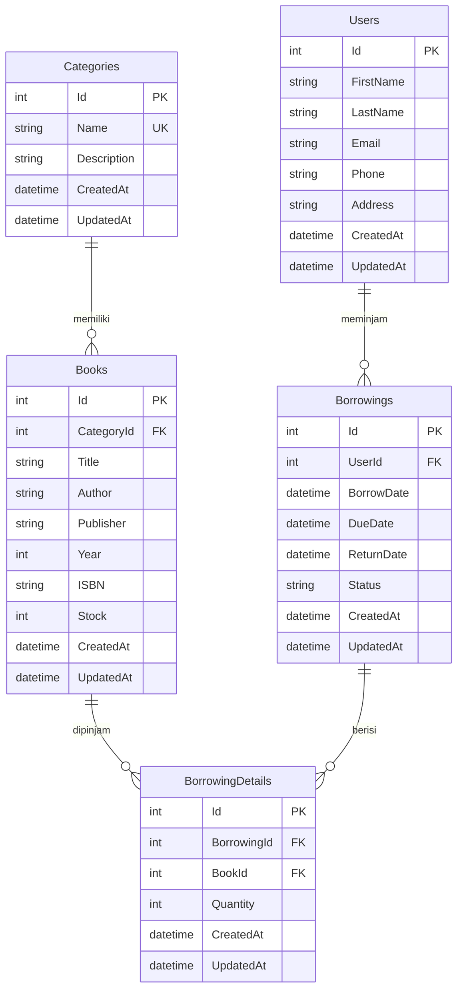

# ERD

## Digital Library Training Kit

---

## Purpose

Menjelaskan Entity Relationship Diagram (ERD) untuk sistem Digital Library, termasuk relasi antar entitas dan cardinality.

---

## Scope

Dokumen ini mencakup:

- Mermaid ERD diagram
- Penjelasan relasi antar tabel
- Cardinality relasi
- Diskusi aggregate
- Flow navigasi

---

## Learning Objectives

Setelah membaca dokumen ini, siswa dapat:

- Membaca dan memahami ERD diagram
- Mengidentifikasi relasi antar entitas
- Memahami cardinality (1:1, 1:N, N:M)
- Memahami konsep aggregate dalam Clean Architecture
- Menavigasi relasi antar tabel

---

## Prerequisites

- Sudah membaca [03-database-design.md](./03-database-design.md)
- Memahami konsep dasar ERD

---

## Business Rules

N/A

---

## Design / Main Content

### Mermaid ERD



### Penjelasan Relasi

#### Relasi 1: Users ↔ Borrowings (One-to-Many)

**Deskripsi:**
- Satu User dapat memiliki banyak Borrowings
- Satu Borrowing dimiliki oleh satu User

**Cardinality:**
- Users (1) → Borrowings (N)
- Borrowings (N) → Users (1)

**Implikasi:**
- Tabel `Borrowings` memiliki foreign key `UserId`
- Jika User dihapus, Borrowings terkait harus di-handle (set NULL atau delete)

**Use Case:**
- Melihat histori peminjaman user
- Menghitung total peminjaman per user

#### Relasi 2: Categories ↔ Books (One-to-Many)

**Deskripsi:**
- Satu Category dapat memiliki banyak Books
- Satu Book termasuk dalam satu Category

**Cardinality:**
- Categories (1) → Books (N)
- Books (N) → Categories (1)

**Implikasi:**
- Tabel `Books` memiliki foreign key `CategoryId`
- Category tidak bisa dihapus jika masih ada Books yang refer

**Use Case:**
- Filter buku by category
- Menampilkan buku per kategori

#### Relasi 3: Books ↔ BorrowingDetails (One-to-Many)

**Deskripsi:**
- Satu Book dapat ada di banyak BorrowingDetails
- Satu BorrowingDetail merefer ke satu Book

**Cardinality:**
- Books (1) → BorrowingDetails (N)
- BorrowingDetails (N) → Books (1)

**Implikasi:**
- Tabel `BorrowingDetails` memiliki foreign key `BookId`
- Stock Book harus di-update saat create/delete BorrowingDetail

**Use Case:**
- Melihat buku yang sering dipinjam
- Tracking stok buku

#### Relasi 4: Borrowings ↔ BorrowingDetails (One-to-Many)

**Deskripsi:**
- Satu Borrowing dapat memiliki banyak BorrowingDetails
- Satu BorrowingDetail termasuk dalam satu Borrowing

**Cardinality:**
- Borrowings (1) → BorrowingDetails (N)
- BorrowingDetails (N) → Borrowings (1)

**Implikasi:**
- Tabel `BorrowingDetails` memiliki foreign key `BorrowingId`
- Cascade delete: jika Borrowing dihapus, semua Details terhapus

**Use Case:**
- Melihat detail buku yang dipinjam dalam satu transaksi
- Menghitung total buku per peminjaman

### Cardinality

**One-to-One (1:1):**
- Tidak ada relasi 1:1 dalam sistem ini
- Contoh: jika ada `UserProfiles` yang strict 1:1 dengan `Users`

**One-to-Many (1:N):**
- Users → Borrowings
- Categories → Books
- Books → BorrowingDetails
- Borrowings → BorrowingDetails

**Many-to-Many (N:M):**
- Borrowings ↔ Books (melalui BorrowingDetails sebagai junction table)
- Ini adalah pola header-detail untuk N:M relationship

### Diskusi Aggregate

Dalam Clean Architecture, **Aggregate** adalah cluster dari domain objects yang diperlakukan sebagai satu unit.

**Aggregate Root:**
- Entity yang menjadi entry point untuk mengakses aggregate
- Memastikan consistency dalam aggregate

**Aggregates dalam Digital Library:**

1. **Borrowing Aggregate**
   - **Root:** `Borrowing`
   - **Members:** `BorrowingDetail`
   - **Invariant:** Max 3 buku per peminjaman
   - **Access:** Hanya melalui `Borrowing` entity

2. **Book Aggregate**
   - **Root:** `Book`
   - **Members:** Tidak ada (leaf entity)
   - **Invariant:** Stock tidak boleh negatif

3. **Category Aggregate**
   - **Root:** `Category`
   - **Members:** Tidak ada (leaf entity)
   - **Invariant:** Nama harus unik

4. **User Aggregate**
   - **Root:** `User`
   - **Members:** Tidak ada (leaf entity)
   - **Invariant:** Email harus valid (jika ada)

**Implikasi Implementasi:**
- Business logic untuk Borrowing harus di service layer yang handle Borrowing aggregate
- Tidak boleh langsung modify BorrowingDetail tanpa melalui Borrowing
- Stock update harus atomic dengan Borrowing creation

### Flow Navigasi

**Navigasi dari User ke Buku yang Dipinjam:**

```
Users → Borrowings → BorrowingDetails → Books
```

**SQL Query:**
```sql
SELECT b.Title, bd.Quantity
FROM Users u
JOIN Borrowings bor ON u.Id = bor.UserId
JOIN BorrowingDetails bd ON bor.Id = bd.BorrowingId
JOIN Books b ON bd.BookId = b.Id
WHERE u.Id = @UserId AND bor.Status = 'Dipinjam'
```

**Navigasi dari Category ke Buku:**

```
Categories → Books
```

**SQL Query:**
```sql
SELECT b.Title, b.Author, b.Stock
FROM Categories c
JOIN Books b ON c.Id = b.CategoryId
WHERE c.Id = @CategoryId
```

**Navigasi dari Book ke Peminjaman:**

```
Books → BorrowingDetails → Borrowings → Users
```

**SQL Query:**
```sql
SELECT u.FirstName, u.LastName, bor.BorrowDate, bor.ReturnDate
FROM Books b
JOIN BorrowingDetails bd ON b.Id = bd.BookId
JOIN Borrowings bor ON bd.BorrowingId = bor.Id
JOIN Users u ON bor.UserId = u.Id
WHERE b.Id = @BookId
```

---

## Implementation Notes

- Gunakan navigation properties di Entity Framework untuk navigasi relasi
- Implement eager loading (Include) untuk menghindari N+1 query problem
- Gunakan junction table untuk N:M relationship
- Pastikan cascade delete di-set dengan benar untuk detail tables

---

## Common Mistakes

- Tidak mengerti cardinality dan salah implement relasi
- Tidak menggunakan junction table untuk N:M relationship
- Lupa cascade delete untuk detail tables
- Tidak menggunakan navigation properties di EF Core
- Menggunakan N+1 query (loop untuk load related data)

---

## Exercises

1. Jelaskan cardinality untuk setiap relasi di ERD
2. Gambarkan flow navigasi dari User ke Book
3. Identifikasi aggregate root untuk setiap aggregate
4. Tulis SQL query untuk mendapatkan semua buku yang sedang dipinjam
5. Jelaskan mengapa BorrowingDetail tidak bisa diakses langsung tanpa Borrowing

---

## Homework

1. Buat ERD diagram menggunakan tool (draw.io, Lucidchart, atau Mermaid)
2. Tulis 5 SQL query berbeda untuk navigasi antar tabel
3. Implement navigation properties di pseudo-code
4. Jelaskan bagaimana cascade delete bekerja untuk BorrowingDetails
5. Design aggregate untuk sistem lain (contoh: Order system)

---

## References

- [Entity Relationship Diagram](https://en.wikipedia.org/wiki/Entity%E2%80%93relationship_model)
- [DDD Aggregates](https://martinfowler.com/bliki/DDD_Aggregate.html)
- [EF Core Relationships](https://docs.microsoft.com/en-us/ef/core/modeling/relationships)

---

## Related Documents

- [03-database-design.md](./03-database-design.md) - Desain database detail
- [06-clean-architecture.md](./06-clean-architecture.md) - Clean Architecture dan aggregate
