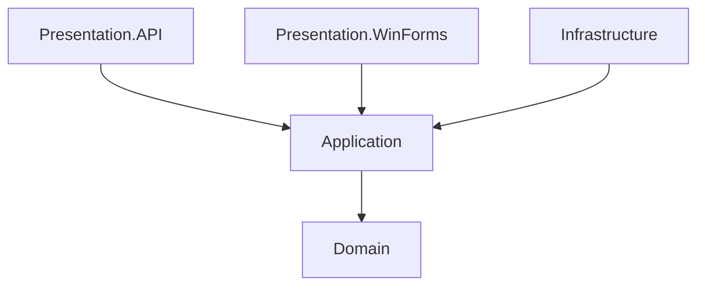

# Architecture Rules & Coding Standard

## Digital Library Project

---

# Purpose

Menentukan aturan arsitektur, standar coding, dan pola interaksi antar layer agar project tetap konsisten, clean, dan mudah dipelihara (maintainable) terutama untuk siswa yang belajar mandiri.

---

# Scope

Dokumen ini mendefinisikan batasan teknis untuk:
* **DigitalLibrary.Domain** (Core business entities)
* **DigitalLibrary.Application** (Use cases, interfaces, DTOs, services)
* **DigitalLibrary.Infrastructure** (EF Core, SQL Server repositories)
* **DigitalLibrary.API** (Controllers, program startup)
* **DigitalLibrary.WinForms & Android** (Clients)

---

# Learning Objectives

* Memahami arah dependensi (Inward Dependency Rule)
* Memahami prinsip Separation of Concerns (SoC)
* Menghindari kopling ketat (Tight Coupling) antara UI/API dengan database
* Menguasai cara pemetaan data menggunakan DTO

---

# Prerequisites

* Memahami dasar Object-Oriented Programming (OOP)
* Memahami perbedaan antara Interface dan Implementasi Class

---

# 1. Architecture Layers & Dependency Rule

Dependensi proyek diatur dengan ketat dengan arah ke dalam (inner layers). Inner layers tidak boleh mereferensikan outer layers.

### Aturan Referensi Project (.csproj):
1. **Domain**: Tidak mereferensikan proyek lain (0 dependencies).
2. **Application**: Hanya mereferensikan proyek **Domain**.
3. **Infrastructure**: Mereferensikan proyek **Application** dan **Domain**.
4. **API / WinForms**: Hanya mereferensikan proyek **Application**. *Catatan: Khusus di entry point API, reference ke Infrastructure diperbolehkan hanya untuk registrasi dependency injection (DI) di Program.cs.*

---

# 2. Layer Responsibilities & Rules

### Domain Layer (Core)
* **Aturan**: Hanya berisi POCO (Plain Old CLR Objects) entity. Tidak boleh ada library database (seperti EF Core) di layer ini.
* **Isi**: Entity C# (User, Book, Category, Borrowing, BorrowingDetail) beserta anotasi validasi basic `[Required]`, `[MaxLength]`.

### Application Layer (Business Logic)
* **Aturan**: Segala logika bisnis, pengecekan validasi stok, batasan peminjaman buku, dan kalkulasi denda wajib ditempatkan di sini.
* **Isi**:
  - Interface repository (`IBookRepository`, dll)
  - Interface service (`IBookService`, dll)
  - DTO (Data Transfer Objects) untuk membatasi properti data yang dikirim keluar.
  - Implementasi service (`BookService`, dll) yang melakukan map/mapping.

### Infrastructure Layer (Data Access & External Services)
* **Aturan**: Hanya bertugas menyimpan dan mengambil data. Tidak boleh menentukan validasi bisnis (misal: memvalidasi apakah buku boleh dipinjam atau tidak).
* **Isi**:
  - `ApplicationDbContext` (EF Core)
  - Implementasi concrete repository (`BookRepository` yang inherits dari `Repository<Book>`).

### Presentation Layer (API & UI Clients)
* **Aturan**: Controller tidak boleh melakukan query EF Core secara langsung (`_context.Books.ToList()`). Controller hanya menerima request DTO, meneruskannya ke Service, dan mengembalikan Response DTO.
* **Isi**: Controllers (REST API), Form (WinForms UI), Kotlin Activity (Android Client).

---

# 3. Coding Standards & Conventions

1. **Async/Await**: Semua interaksi dengan database atau API call wajib bersifat Asynchronous. Gunakan tipe data return `Task` atau `Task<T>`.
2. **Naming Convention**:
   - Interface: Awali dengan huruf `I` (misal: `IRepository<T>`, `IBookService`).
   - Repository implementation: Akhiri dengan `Repository` (misal: `BookRepository`).
   - Service implementation: Akhiri dengan `Service` (misal: `BookService`).
   - DTO: Akhiri dengan `Dto`, `CreateBookDto`, `BookDto` (untuk response).
3. **Strict DTO Mapping**: Jangan pernah mengembalikan database entity (`Book`) langsung ke Client. Selalu map entity tersebut ke response DTO (`BookDto`) menggunakan mapper (AutoMapper atau manual mapping).

---

# Common Mistakes (Wajib Dihindari)

* ❌ **Logic di Controller**: Menulis validasi stok buku di dalam `BooksController.cs`.
* ❌ **Direct EF Core**: Menggunakan `ApplicationDbContext` langsung di dalam Controller.
* ❌ **Leakage of Database**: Membagikan database entity ke UI client. Hal ini merusak independensi UI.
* ❌ **Blocking Calls**: Menggunakan `.Result` atau `.Wait()` pada asynchronous calls.

---

# Exercises & Self-Review

1. Gambar diagram dependensi proyek Anda setelah melakukan setup proyek di Task 2. Pastikan tidak ada referensi melingkar (circular dependency).
2. Temukan kode controller yang langsung memanggil DbContext, lalu buatlah rencana untuk memindahkan logika tersebut ke Application Service menggunakan generic repository.

---

# References

* *Clean Architecture: A Craftsman's Guide to Software Structure and Design* by Robert C. Martin (Uncle Bob).
* Microsoft Architecture Guides: Common Web Application Architectures.
